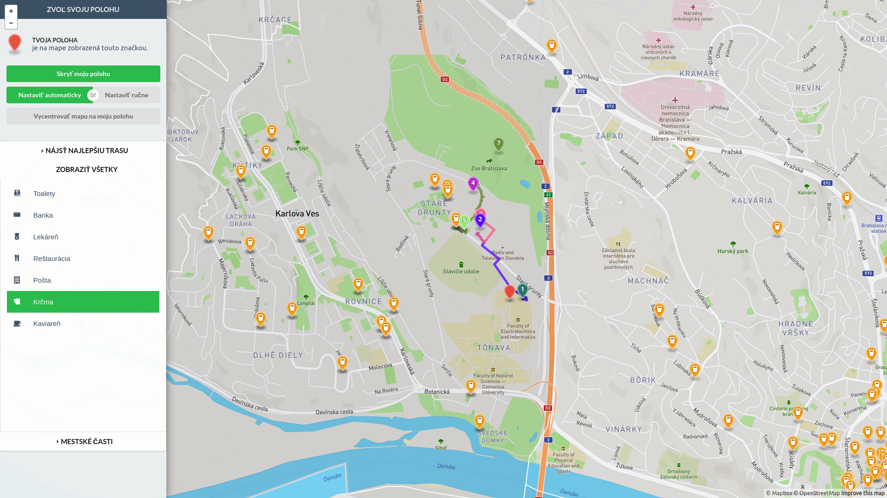

# Matej Víťaz - PDT Project - `Vybavovačky`

## O čo ide
Aplikácia je určená na pomoc pri každodenných vybavovačkách v meste. Zadajte svoju polohu, zvoľte čo chcete vybaviť (banka, pošta a nakoniec pivo) a aplikácia zistí najvhodnejšiu trasu. Tiež je mžoné zorbazovať kaviarne, krčmy, lekárne v okolí. Všetko je možné filtrovať na základe mestských častí.



## Architektúra
Aplikácia je vytvorená ako webová aplikácia pozostávajúca z dvoje komunikujúcich súčastí: frontendu a backendu. Komunikujú pomocou REST JSON.

## Frontend
Frontend aplikácia využíva technológie jQuery, jQuery UI, Mapbox.js. HTML frontendu sa nachádza v súbore [`/resources/views/app.blade.php`](https://github.com/mspiderv/pdt-project-1/blob/master/resources/views/app.blade.php). Logika aplikcácie je v súbore [`public/js/main.js`](https://github.com/mspiderv/pdt-project-1/blob/master/public/js/main.js).

### Hľadanie trasy
Na výpočet optimálnej trasy aplikácia využíva [Mapbox API](https://www.mapbox.com/api-documentation/#directions).

## Backend
Logika backendu je v súbore [`app/Http/Controllers/FeaturesController.php`](https://github.com/mspiderv/pdt-project-1/blob/master/app/Http/Controllers/FeaturesController.php). Backend aplikácia je založená na PHP frameworku [Laravel](https://laravel.com/). Všetky dopyty na API prijímajú GET atribút `selectedParts`, ktorý osbahuje pole názvov mestských častí. Výstupom volaní API sú body a polygóny, ktoré patria zloveným mestským častiam. Laravel dopytuje Postgres databázu s PostGis rozšírením. Backend poskytuje nasledovné API:

 - GET /api/features/amenity/{amenity}
    - vráti body na mape daného typu
 - GET /api/features/nearest/{amenity}/{longitude}/{latitude}
    - vráti najbližší bod daného typu od zadaného súčasného bodu
 - GET /api/features/polygons
    - vráti polygóny mestských častí

## Zdroj dát
https://www.openstreetmap.org

## Inštalácia
```
$ git clone https://github.com/mspiderv/pdt-project-1
$ cd pdt-project-1
$ sudo chmod a+x ./install.sh
$ sudo ./install.sh
```

## Import mapových dát
```
$ osm2pgsql -H localhost -s -U postgres -d {DB_NAME} --latlong {FILE}
```